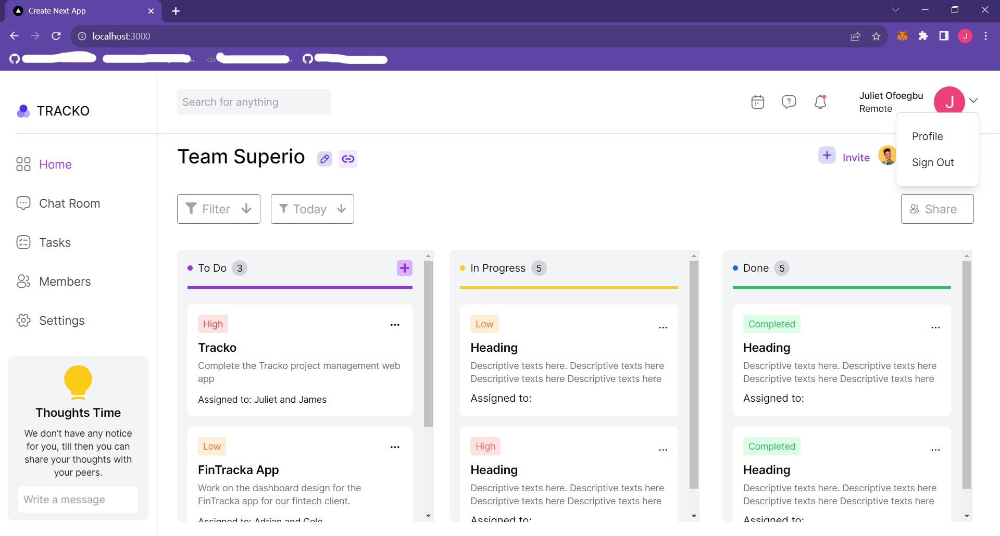

# PROJECT DOCUMENTATION

# TRACKO: PROJECT MANAGEMENT WEB APPLICATION
### This is a desktop web application.

## About The Project 

This is a project management DESKTOP web application. It is NOT optimized for mobile view yet. 

## Web App UI
 

## Technologies Used

- Nextjs
- Typescript
- Tailwindcss for styling
- Firebase for Authentication and Real-time Dataabase Storage
- Redux for State Management
- LocalStorage to store and fetch data from the profile settings
- Other libraries: React-icons, React-toastify- React-modal, and React-datepicker

## App Features

- Signup or Login functionality with Firebase.
- Home page where tasks can be viewed, added and assigned to members, edited and deleted. The header containing some features like 'View events' and 'Set events' can be used by team members to view and set events or meetings for members.
- Chat Roomw: This is a messaging feature powered by Firebase. Members of a team can send messages in this chat room and anyone in logged in member of the team can reply just like a 'WhatsApp' group.
- Tasks page: Featires hasn't been implemented yet.
- Memebers page: Featires hasn't been implemented yet.
- Settings page to configure the application. This page is divided into 4 sections. 
   - Account settings to enable users set their account details.
   - Profile settings section consisting of a form for users to update their profile. This update can be viewed fully in profile page(/profile)
   - Security settings section consisting of a form for users to reset their password(this feature isn't functional yet).
   - Help and Support section to lay a complaint about the application or send a message to help resolve an issue.

## Sidebar Navigation 🔍

- Home
- Chat room
- Tasks
- Members 
- Settings

## App Links 
Production Link: ()

Project Github Repo Link: (https://github.com/OmaJuliet/TRACKO-APP.git)

## Get it on your local machine
To get this Nextjs-Typescript application on your local machine, you need to follow these steps.

## Prerequisites
- Node.js (v14.17.6 or later)
- npm (v6.14.15 or later)

### Installation
1. Clone the repository or download the source code from GitHub. To clone it, use this command "git clone repo-link"
2. Open a terminal or command prompt and navigate to the project directory.
3. Run `npm install` to install the project dependencies.

### Running and Testing the application
2. Run `npm run dev` to start the development server.
3. Open a web browser and go to http://localhost:3000 to view the application.